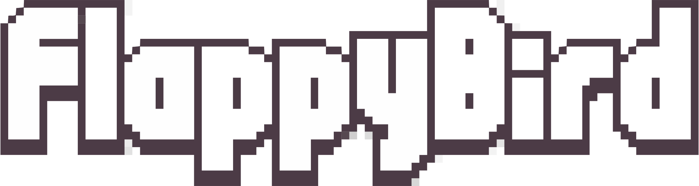

 
<h1 align="center">Flappy Bird   </h1>

## 🔖 Descrição 
Criação do jogo Flappy Bird utilizando JavaScript através das aulas do [Mario Souto](https://www.youtube.com/watch?v=jOAU81jdi-c&list=PLTcmLKdIkOWmeNferJ292VYKBXydGeDej).

## 💻 Tecnologias
* HTML5/Canvas
* JavaScript

## 🖼 Run

## 📝 Licença
O projeto se encontra sob licença MIT. Para mais detalhes, acesse [license](LICENSE).

Criado com 💙 por [Rafael Simionato](https://github.com/rafaasimi/)
